# Topological Map: Embedded Search for Browser Engine

---
okf_schema: okf.topological_map.v1
generated_utc: "2026-07-01T14:00:00Z"
source_agents: [tantivy-research, meilisearch-scoping, hybrid-vector-research, search-security, lgwks-landscape]
verification_method: "crates.io JSON API + GitHub commits API + raw README/CHANGELOG fetches"
---

## Node Graph

```mermaid
graph TD
    subgraph "Verified Libraries"
        TANTIVY[tantivy 0.26.1<br/>BM25, pure Rust, 15.5k★]
        LAURUS[laurus 0.9.0<br/>Hybrid BM25+Vector, pure Rust]
        USEARCH[usearch 2.25.3<br/>Vector HNSW, C++ core]
        SEEKSTORM[seekstorm<br/>Hybrid BM25+Vector, pure Rust]
        INSTANT[instant-distance 0.6.1<br/>HNSW only, pure Rust]
    end

    subgraph "Fabricated / Dead"
        FOXSTASH[foxstash<br/>FABRICATED]
        VXDB[vxdb<br/>FABRICATED]
        HORA[hora<br/>DEAD since 2021]
        SONIC[sonic<br/>NOT embedded, server]
    end

    subgraph "Extracted Patterns"
        P1[P1: Eval-Free Query AST]
        P2[P2: Predeclared Filterable = Capability List]
        P3[P3: Authz-as-Filter AND-first]
        P4[P4: Pre-filtered KNN]
        P5[P5: Score Suppression]
        P6[P6: Bucket-Sort Ranking → Lattice]
        P7[P7: Index Partition per Scope]
        P8[P8: Scope-Bound Cache]
        P9[P9: Append-Only Audit Trail]
        P10[P10: Fail-Closed Result Type]
        P11[P11: Journal Replay Reconstruction]
        P12[P12: Opstamp Contiguous Batching]
    end

    subgraph "OKF Principles"
        OKF1[Binary-First]
        OKF2[Scoped Retrieval]
        OKF3[Typed Output]
        OKF4[Deterministic Fallback]
        OKF5[Audit Evidence]
        OKF6[Authz Before Retrieval]
        OKF7[Leak Prevention]
        OKF8[Fail-Closed]
        OKF9[Human Reconstructability]
    end

    subgraph "Browser Engine Requirements"
        R1[R1: Per-page scope isolation]
        R2[R2: Per-session scope isolation]
        R3[R3: Typed Candidate output]
        R4[R4: No scores returned to caller]
        R5[R5: Journal-reconstructable index]
        R6[R6: Result<_, FailClosed> return]
        R7[R7: Unforgeable Scope type]
        R8[R8: QueryPlan sanitized AST]
        R9[R9: AND-composition only]
        R10[R10: Audit every query]
    end

    %% Library → Pattern edges
    TANTIVY -->|provides| P1
    TANTIVY -->|provides| P11
    TANTIVY -->|provides| P12
    TANTIVY -->|FilterCollector| P7
    LAURUS -->|faceting| P7
    LAURUS -->|RRF fusion| P6
    USEARCH -->|filtered_search| P4
    SEEKSTORM -->|hybrid| P6

    %% Meilisearch pattern source
    MEILI((meilisearch<br/>pattern source)) -->|extracted| P2
    MEILI -->|extracted| P3
    MEILI -->|extracted| P6

    %% OWASP pattern source
    OWASP((OWASP RAG<br/>+ Multi-Tenant)) -->|extracted| P4
    OWASP -->|extracted| P5
    OWASP -->|extracted| P8
    OWASP -->|extracted| P9
    OWASP -->|extracted| P10

    %% Pattern → OKF edges
    P1 -->|enforces| OKF8
    P2 -->|enforces| OKF2
    P3 -->|enforces| OKF6
    P4 -->|enforces| OKF6
    P4 -->|enforces| OKF7
    P5 -->|enforces| OKF7
    P6 -->|enables| OKF3
    P7 -->|enforces| OKF2
    P7 -->|enforces| OKF7
    P8 -->|enforces| OKF7
    P9 -->|enforces| OKF5
    P10 -->|enforces| OKF8
    P11 -->|enables| OKF4
    P12 -->|enables| OKF4

    %% OKF → Requirement edges
    OKF1 --> R5
    OKF2 --> R1
    OKF2 --> R2
    OKF3 --> R3
    OKF4 --> R5
    OKF5 --> R10
    OKF6 --> R8
    OKF7 --> R4
    OKF7 --> R9
    OKF8 --> R6
    OKF8 --> R7
    OKF9 --> R5
```



## Adjacency Matrix: Library × Feature

| Feature | tantivy | laurus | usearch | seekstorm | instant-distance |
|---------|:-------:|:------:|:-------:|:---------:|:----------------:|
| BM25 full-text | ✅ | ✅ | ❌ | ✅ | ❌ |
| Vector / ANN | ❌ | ✅ | ✅ | ✅ | ✅ |
| True hybrid (1 API) | ❌ | ✅ | ❌ | ✅ | ❌ |
| Pure Rust | ✅ | ✅ | ❌ C++ | ✅ | ✅ |
| Embedded (no server) | ✅ | ✅ | ✅ | ✅ | ✅ |
| WASM target | ⚠️ rayon | ✅ | ✅ | ❓ | ❌ |
| Scoping/filtering | ✅ FilterCollector | ✅ faceting | ✅ predicate | ❓ | ❌ |
| Disk persistence | ✅ mmap | ✅ WAL | ✅ mmap | ❓ | ❌ |
| Journal replay | ✅ Opstamp | ⚠️ WAL | ❌ | ❓ | ❌ |
| License | MIT | MIT | Apache | ❓ | MIT |
| Maturity | 15.5k★ v0.26 | 404 dl v0.9 | 121k/mo v2.25 | ❓ | 96k/mo v0.6 |
| Last active | 2026-05 | 2026-05 | current | ❓ | 2023-06 stale |
| OKF Score | **32/35** | **22/25** | **19/25** | ❓ | **14/25** |

## Adjacency Matrix: Pattern × OKF Principle

| Pattern | Binary-First | Scoped | Typed | Fallback | Audit | Authz-Before | Leak-Prevent | Fail-Closed | Human-Recon |
|---------|:---:|:---:|:---:|:---:|:---:|:---:|:---:|:---:|:---:|
| P1 Eval-Free AST | | | | | | ● | | ● | |
| P2 Filterable=Cap | | ● | | | | | | | |
| P3 Authz-AND-Filter | | ● | | | | ● | | | |
| P4 Pre-Filtered KNN | | | | | | ● | ● | | |
| P5 Score Suppress | | | ● | | | | ● | | |
| P6 Bucket-Sort | | | ● | | | | | | |
| P7 Partition/Scope | | ● | | | | | ● | | |
| P8 Scope Cache | | | | | | | ● | | |
| P9 Audit Trail | | | | | ● | | | | |
| P10 Fail-Closed | | | | | | | | ● | |
| P11 Journal Replay | | | | ● | | | | | ● |
| P12 Opstamp Batch | | | | ● | | | | | |

## Defense-in-Depth Layering (10 layers, each independently sufficient)

| Layer | Pattern | Guarantees | OKF Principle | Composition |
|-------|---------|------------|---------------|-------------|
| 1 | Type boundary: `Scope` unforgeable | No scope ⇒ no query compiles | Fail-Closed | AND |
| 2 | P1: Sanitization (eval-free AST) | No injection reaches engine | Fail-Closed | AND |
| 3 | P3: Scope rewriting (RLS analog) | Scope predicate on every query | Authz-Before | AND |
| 4 | P7: Index partition per scope | Wrong scope can't address partition | Leak-Prevent | AND |
| 5 | P4: Pre-filtered KNN | Unauthorized vectors never visited | Authz-Before | AND |
| 6 | P5: Score suppression (typed Candidate) | No differential side-channel | Leak-Prevent | AND |
| 7 | Per-object post-filter (ABAC) | CWE-639/IDOR neutralized | Authz-Before | AND |
| 8 | P8: Scope-bound cache | No cross-scope cache leak | Leak-Prevent | AND |
| 9 | P9: Audit trail (append-only) | Forensic + anomaly detection | Audit | AND |
| 10 | P10: Deterministic scoped fallback | Never degrades to unscoped | Fail-Closed | AND |

**Critical invariant:** Layer composition is **AND/intersection (most-restrictive-wins)**, never OR/union. (From Elastic DLS multi-role footgun: combining DLS role with non-DLS role = all docs.)

## Critical Footguns (must be encoded as tests)

| # | Footgun | Source | Mitigation |
|---|---------|--------|------------|
| 1 | Omitted filter = fail-OPEN | Elastic DLS | Missing scope filter = build error / deny |
| 2 | Multi-capability OR-widening | Elastic DLS | Capability composition = intersection (AND) |
| 3 | Aggregation/score side-channel | Elastic DLS | Suppress scores; restrict aggregations to partition |
| 4 | Regex from user input | OWASP NoSQL | Regex must be server-compiled from allowlist |
| 5 | LLM→raw query→DB | Logic OS §12.3 | LLM output → typed action → validation → scoped query |
| 6 | Embedding inversion | OWASP RAG §2 | Treat embeddings as sensitive; encrypt at rest |

## Recommendation: Architecture Decision

### Primary: Tantivy (BM25) + Thin Vector Layer (future)

**Rationale:**
- Tantivy is the ONLY production-ready pure-Rust embedded FTS engine (32/35 OKF)
- Laurus is the only true hybrid but pre-1.0 (404 downloads, bus-factor risk)
- Building hybrid = Tantivy (lexical) + minimal HNSW (vector) + RRF fusion
- This follows OKF §22.1: "Keep SQL, but only as operational projection" → keep Tantivy as the operational search primitive, add vector as a projection layer

**Integration approach:**
```
default-features = false  (kill mmap for portability)
+ RamDirectory            (in-memory, or custom Directory over OPFS)
+ one Index per scope     (strong isolation, partition-per-scope)
+ build_query_from_user_input_ast  (authorization checkpoint)
+ replay (Opstamp, UserOperation) log  (deterministic reconstruction)
```

### Fallback: Laurus (if it matures to 1.0)

Monitor laurus adoption. If it reaches 1.0 with >10k downloads, switch to it for native hybrid support.

### Rejected: USearch (C++ dep), Sonic (server), Hora (dead)

## Tooling Notes

- `lgwks research --quick` IS useful for doc retrieval (returned verbatim Tantivy code) — ISS-003 is FALSE for this subcommand
- `lgwks agent` IS broken (returns self-model) — ISS-003 CONFIRMED for agent front door
- `web-search-prime` rate-limited to 2026-07-22 — use GitHub API + raw fetches as fallback
- `crwl crawl` works but webfetch on raw GitHub URLs is faster for README/CHANGELOG
